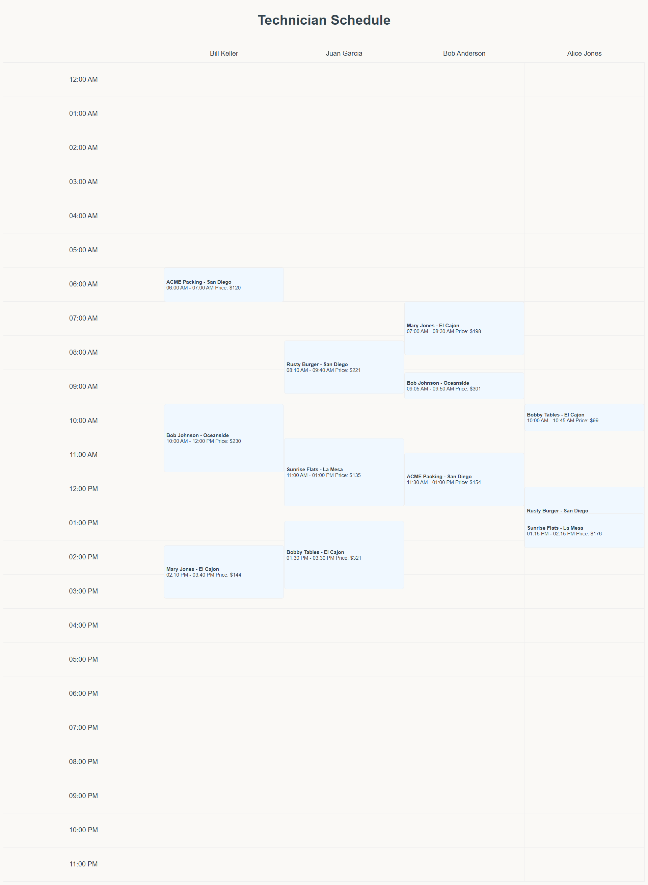

# Terrier Rails Assessment



The application was designed with a focus on simplicity and clarity, adhering to the Ruby on Rails MVC (Model-View-Controller) pattern to ensure separation of concerns. Models were created to map the provided data schema, and rake tasks were implemented to handle idempotent CSV imports. The scheduling grid leverages a dynamic frontend design to visually represent technicians and their work orders, enabling user interactivity through client-side alerts for schedule availability.

## Setting Up the Project

1. Clone the repository:

   ```bash
   git clone https://github.com/TishG/terrier_rails_assessment.git
   cd terrier_rails_assessment

   ```

2. Install Dependencies:
   bundle install

3. Set up the database:
   rails db:drop RAILS_ENV=development
   rails db:create RAILS_ENV=development
   rails db:migrate RAILS_ENV=development

4. Import CSV data:
   rake csv:import

5. Start the Rails server:
   rails server

6. Access the application at http://localhost:3000/schedules.
